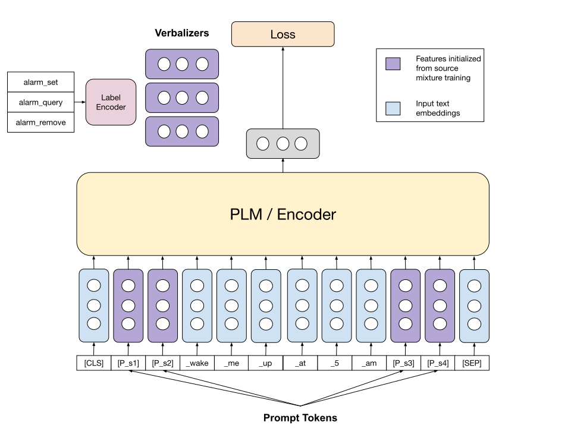

<sup>Training Methodology for WARP Transfer </sup>


<sup>WARP Transfer initializes tokens and verbalizers using a hierarchical training approach which leads to significant improvement in results especially in low resource scenarios </sup>

Prompt-based methods have recently gained popularity for their capability to generalize to multiple downstream tasks with high parameter efficiency. In this work, we improve these methods especially WARP by utilizing knowledge transfer between related tasks and thereby increase parameter efficiency in multi-domain scenarios, particularly in natural language understanding.

# Setup
The code requires our custom fork of YerevaNN's internal version of `allennlp`
```
git clone https://github.com/asit2898/allennlp
git checkout warp
pip install .
```

# Training

## Training WARP-Transfer Stage 1
```ssh
export DATASET="mnli"
export HPARAMS='{
    "benchmark":"glue",
    "classifier_init":null,
    "dataset":"'$DATASET'",
    "ensure_whitespace_between":false,
    "lr":0.001,
    "max_batch_size":8,
    "max_tokens_sq":262144,
    "num_epochs":30,
    "prompt_better_init":"<mask>",
    "prompts":[-10,-11,-12,-13,-14,null,-15,-16,-17,-18,-19,"<mask>",-20,-21,-22,-23,-24,null,-25,-26,-27,-28,-29],
    "seed":1,
    "transformer_model":"roberta-large"
}'
python -m allennlp train -s .aim/t-mnli-cb-joint configs/mnli_cb_joint.jsonnet
```
## Training WARP-Transfer Stage 2

```sh
python -m allennlp train -s .aim/t-mnli-cb-stage-2 configs/mnli_init_cb_joint.jsonnet
```

## WARP on NLU evaluation data
```sh
export DATASET="alarm"
export HPARAMS='{
    "classifier_init":null,
    "dataset":"nlu",
    "path": "'$DATASET'",
    "ensure_whitespace_between":false,
    "lr":0.001,
    "max_batch_size":8,
    "max_tokens_sq":262144,
    "num_epochs":30,
    "prompt_better_init":"<mask>",
    "prompts":[-10,-11,-12,-13,-14,null,-15,-16,-17,-18,-19,"<mask>",-20,-21,-22,-23,-24,null,-25,-26,-27,-28,-29],
    "seed":1,
    "transformer_model":"roberta-large"
}'
python -m allennlp train -s .aim/t-${DATASET} configs/nlu.jsonnet
```
